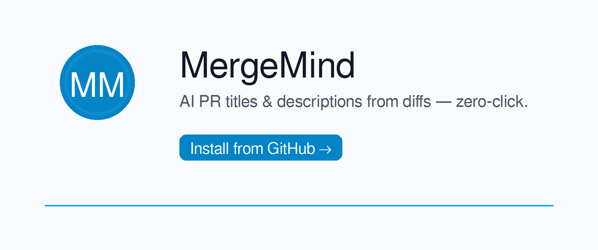

<p align="center">
  <picture>
    <source media="(prefers-color-scheme: dark)" srcset="assets/marketing/mergemind_banner_dark.png">
    
  </picture>
</p>

# MergeMind


[](LICENSE)
[](CONTRIBUTING.md)
[](https://github.com/gusinfosec/MergeMind/stargazers)

> **Stop wasting hours writing PR text. MergeMind turns raw diffs into clean, consistent titles and summaries — instantly.**

---

## 💳 Get MergeMind

Save hours every sprint with automated PR titles & descriptions.  
Choose a subscription tier or a one-time download.

<p align="center">
  <a href="https://buy.stripe.com/8x2bJ10rS5Cv4bDdP1fbq00">
    
  </a>
  <a href="https://buy.stripe.com/28E5kD4I8aWPdMdfX9fbq01">
    
  </a>
  <a href="https://buy.stripe.com/eVqeVddeE9SL0ZrcKXfbq02">
    
  </a>
</p>

### ☕ One-Time Ko-fi Purchase
Prefer a single purchase? Get the current version as a direct download.  
(Future updates require a new purchase or Stripe subscription.)

<p align="center">
  <a href="https://ko-fi.com/s/8fa53b788d">
    
  </a>
</p>

---

## 📊 Compare Plans

| Feature                                | Pro ($7/mo) | Startup ($29/mo) | Enterprise ($299/mo) |
|----------------------------------------|-------------|------------------|-----------------------|
| AI-generated PR titles & descriptions  |  |  |  |
| Zero-click GitHub Action integration   |  |  |  |
| Team-ready workflows & presets         |  |  |  |
| Standardized commit styles             |  |  |  |
| Priority updates & roadmap influence   |  |  |  |
| Advanced integrations (Atlassian, etc.)|  |  |  |
| Premium support & onboarding           |  |  |  |

---

## 🚀 Quick Install

1. Copy the workflow snippet from [`.github/workflows/pr-ai-describer.yml`](.github/workflows/pr-ai-describer.yml).  
2. Add your `OPENAI_API_KEY` as a repository secret.  
3. Open a PR — MergeMind will comment with a suggested title + summary.  

👉 [Privacy policy](PRIVACY.md) · [Contributing](CONTRIBUTING.md) · [Roadmap](ROADMAP.md)

---

## 🚀 Purpose

Developers waste hours on repetitive PR text. MergeMind writes it for you — with clarity and consistency — so you can ship faster.

### Problem it solves
- Developers spend ~5 min per PR writing titles and summaries.  
- A 10-person team wastes ~5 hours/week (~$1,000/month) in lost velocity.

### What it does
- Watches for new PR events (`pull_request.opened`, `edited`, `synchronize`).  
- Downloads the PR diff (the unified `+`/`-` patch).  
- Sends the diff to the model (e.g., GPT-4o-mini) with a prompt like:  
  *“Summarise these changes for reviewers in 80–120 words.”*  
- Posts the generated text back to the PR (comment or overwrite body).

**Result:** Zero-click PR descriptions that are consistent, concise, and follow conventional-commit style.  
Saves each developer ~30 min/week — perfect foundation for a paid Marketplace tier.

---

## 💡 Why MergeMind?

Teams lose hours every sprint writing boilerplate PR text. MergeMind turns raw diffs into clear, consistent PR titles and summaries—automatically.

- **Faster reviews** → reviewers get the right context in seconds.  
- **Better documentation** → standardized titles & bodies.  
- **Less context switching** → developers keep coding, not wordsmithing.

---

## ⚙️ How It Works

1. **Trigger:** PR opened/edited/synchronized.  
2. **Collect:** Fetch diff (`+`/`-` lines) per file.  
3. **Generate:** Ask the model for a concise title + summary (optionally include risk & test steps).  
4. **Publish:** Comment on the PR or overwrite its body—your choice via config.

---

## 📦 Installation (GitHub Actions)

Create the workflow file:

**Path:** `.github/workflows/pr-ai-describer.yml`
```yaml
name: PR AI Describer
on:
  pull_request:
    types: [opened, edited, synchronize]

permissions:
  contents: read
  pull-requests: write

jobs:
  describe:
    runs-on: ubuntu-latest
    steps:
      - uses: actions/checkout@v4
      - uses: actions/setup-node@v4
        with:
          node-version: '20'
      - run: npm ci
      - name: Generate and comment
        run: node src/action.js
        env:
          OPENAI_API_KEY: ${{ secrets.OPENAI_API_KEY }}
          GITHUB_TOKEN: ${{ secrets.GITHUB_TOKEN }}
          REPO_FULL: ${{ github.repository }}
          PR_NUMBER: ${{ github.event.number }}
```

Add your API key as a **repo secret**:  
**Settings → Secrets and variables → Actions → New repository secret**
- Name: `OPENAI_API_KEY`
- Value: your OpenAI key (never commit keys to the repo)

---

## 🛠 Local Development

**Requirements:** Node.js 20+

Clone & install:
```bash
git clone https://github.com/gusinfosec/pr-copilot-extension.git mergemind
cd mergemind
npm install
```

Run with the included sample diff:
```bash
export OPENAI_API_KEY="sk-..."   # set in your shell for this session
node src/index.js
```

Test with a real diff from any repo:
```bash
# from your other repo
git diff --unified=0 > /tmp/mergemind.diff

# back in MergeMind repo
cp -f /tmp/mergemind.diff sample.diff
node src/index.js
```

---

## ⚡ Configuration

Tune behavior via a repo-root config file:

**Path:** `.pr-describer.yml`
```yaml
style: conventional-commit      # options: casual | formal | conventional-commit
summary_length: 100             # target word count
min_changed_lines: 5            # skip tiny PRs unless forced
post_mode: comment              # comment | overwrite

labels:
  skip:  ["no-ai", "draft"]     # if present, skip (unless force)
  force: ["ai-describe"]        # if present, always run
```

Create labels once (optional, but recommended):
- `no-ai` → skip this PR  
- `ai-describe` → force run

---

## 🧪 What You’ll See on a PR

- **Comment mode:** a bot comment with “Suggested PR Title & Description.”  
- **Overwrite mode:** the PR body is replaced with the generated summary.  
- Summaries often include **Risk/Impact** and **Testing Steps** for reviewers.

---

## 🔐 Security Notes

- Keep your `OPENAI_API_KEY` only in **GitHub Secrets** and your local shell env.  
- Do not commit secrets to the repo.  
- Principle of least privilege: this Action needs `pull-requests: write` to post comments.

---

## 🚀 Roadmap (TL;DR)
**0–3m:** Marketplace, licensing + Stripe verifier, starter policy presets  
**3–6m:** Enterprise presets, team analytics, multi-language PR/commits  
**6–12m:** Compliance-aware AI rules, advanced Stripe, Atlassian/GitLab/Azure integrations

---

## 🤝 Contributing

PRs welcome! Open an issue to propose changes or new styles.  
For larger features, outline your approach first so we can align on direction.

---

## 📜 License

This project is licensed under the terms of the **MIT license**.  
See the [LICENSE](LICENSE) file for details.

---

## 🏷️ Tags 
`github-actions` · `pull-requests` · `ai` · `openai` · `developer-productivity`
